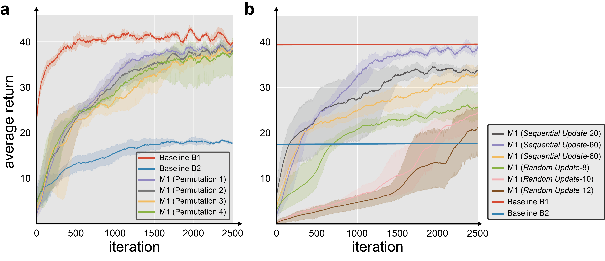
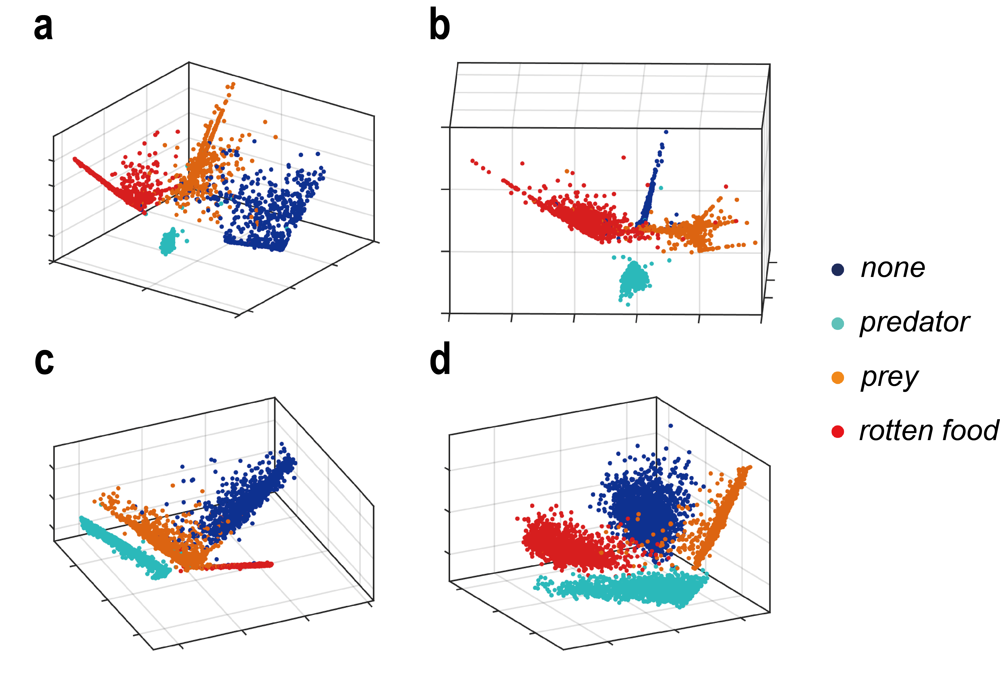
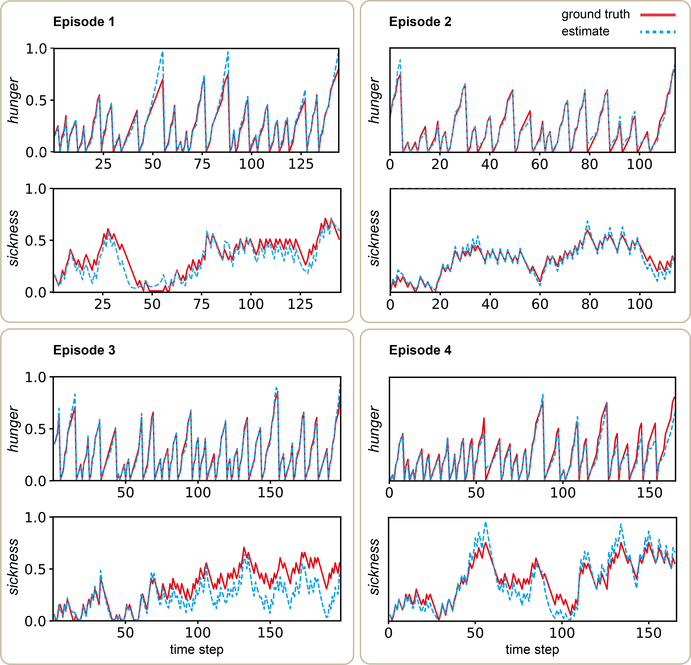

# Inducing Functions through Reinforcement Learning without Task Specification

This repository is the official implementation of [Inducing Functions through Reinforcement Learning without Task Specification](https://arxiv.org/abs/2111.11647).
The implemented code is mostly brought from [rlkit](https://github.com/vitchyr/rlkit).

## Requirements

To install requirements:

```setup
conda create -n induce python=3.6.5
conda activate induce
pip install -r requirements.txt
```

Data for survival environment (preprocessed MNIST image dataset) is required for execution of the code.
Please download [mnist](https://drive.google.com/drive/folders/1ppcrYsO71KcHXKSVUOX6Gl0Ghfm-QwIc?usp=sharing) and put `mnist` folder in `./env_survive`.

## Training

There are Main M1, Baseline B1, B2 from the paper. To train Baseline B1 or B2, run this command:
```train b1b2
python -m examples.dqn_v
```
B1 can be specified by setting `raw_status=True` in `dqn_v.py`. B2 is specified if `raw_status=False`. 

To train Main M1, run this command:
```train m1
python -m examples.dqn_real
```
In `dqn_real.py`, there are some parameters that can be controlled for different conditions.
If you want to train the M1 with the Update method (sequential update) proposed in the paper, set `sequential_update = True` and use 
`fixed_sequence = 60`. `fixed_sequence` is the length of sequence for predicting hidden variables.
If you want to train the M1 from [Kapturowski et al. (2019)](https://openreview.net/forum?id=r1lyTjAqYX), set `sequential_update = False`
and use `T=8` in `env_survive_real.py`. `T` is the length of sequence for predicting hidden variables in randomly
sampled transactions.

## Evaluation

Evaluation is quite simple. After training the model, in `./data` folder, `task_b_sequence_ext_use_pred_202x_xx_xx_xx_xx_xx_0002--s_60` is all you need.
To see the learning curve of the trained model, run following commands:
```learning curve
python -m scripts.plot ./data/task_b_sequence_ext_use_pred/ --f "evaluation/Average Returns"
python -m scripts.plot_single ./data/task_b_sequence_ext_use_pred/{} --f "evaluation/Average Returns,exploration/Average Returns|evaluation/death_p,evaluation/death_h,evaluation/death_s"
```

If you want to reconstruct the result from the paper (linearity check, pca, hidden variable prediction), run this command:
```run policy
python -m scripts.run_policy ./data/task_b_sequence_ext_use_pred/task_b_sequence_ext_use_pred_202x_xx_xx_xx_xx_xx_0002--s_60
```
After running this command, check `log_dir` folder in corresponding trained model folder.


## Pre-trained Models

You can download pretrained models in `recurrent_rl` folder:

- [recurrent_rl](https://drive.google.com/drive/folders/1ppcrYsO71KcHXKSVUOX6Gl0Ghfm-QwIc?usp=sharing) 

You can see the results from paper in each model's `log_dir` folder, or use above Evaluation commands
to reconstruct the result. Details about models in the folder is as follows:
```pretrained model
task_b_random_ext_8_yyyy_... : T=8
task_b_sequence_ext_use_pred_20_yyyy_... : fixed_sequence=20
```

## Results

### Learning curve



### Image classification



### Hidden variable prediction



## Contributing
The base code is from [rlkit](https://github.com/vitchyr/rlkit). We will make it public after the review.
